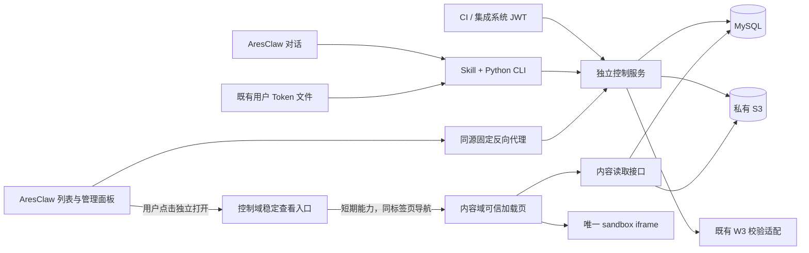

# AresClaw 看板设计

更新：2026-09-09。本文说明当前实施目标与系统边界；任务状态、审查和测试只记在 [progress.md](progress.md)，接口定义见 [contracts.md](contracts.md)。代码仍在实施工作树，本文不代表内网生产验收。

## 1. 产品范围

AresClaw 是内网 Codeg 网页部署。用户在对话中生成单个静态 HTML，通过 Skill + Python CLI 保存或发布到独立看板服务；也可在 AresClaw 看板列表管理内容、版本和权限。

看板 ID 和分享链接长期稳定，更新频率不限。每次保存生成不可变版本；已上线内容可以同时拥有待发布草稿。普通更新无需先下架，也不新增定时调度器。

本轮包含草稿、发布、更新、历史、回滚、下架/恢复、用户/群组/集成账号授权、公开有效期、操作恢复和审计。没有匿名公开、自动执行 HTML 缩略图、多文件网站上传、永久删除、自动历史清理或审批流。

## 2. 技术架构

| 组件 | 技术与职责 |
| --- | --- |
| AresClaw 网页 | 现有 Next.js 静态导出、React、TypeScript、Tailwind/shadcn/ui、next-intl；卡片列表与侧边管理面板 |
| 对话入口 | Skill + Python 标准库 CLI；读取产物、冻结请求、直连公共 API |
| 公共控制服务 | Python、FastAPI/Uvicorn、SQLAlchemy、PyMySQL、Alembic、PyJWT、Boto3；认证、ACL、发布、版本、配额、审计 |
| 公共内容服务 | 同一 Python 包的独立入口进程；可信查看加载页与内容读取 |
| MySQL 8 / InnoDB | 主体、ACL、群组、版本引用、双指针、operation、配额和审计 |
| 私有 S3 | 所有已提交 HTML 版本的唯一持久来源；本地仅暂存 |
| 现有反向代理 | TLS、固定 Origin/路由、AresClaw 同源 API 转发 |

公共服务是模块化单体，不引入 Rust、SQLite、Redis、消息队列或 MCP。两个入口进程可以部署在同一服务器，业务模块在进程内复用；内容入口不暴露管理 API。

AresClaw 不新增 Rust 发布代理、session bridge、ACP/AppState/SessionRegistry 改造或 dashboard_list transport command。该特性仅 Web 模式显示，保留 Codeg 原有文件预览功能。

## 3. 人机与机机身份

人机认证沿用已集成的 W3 / Huawei Uniportal OAuth2。公共服务通过真实内网适配器验证凭据，不能假定 access_token 是 JWT；稳定主体来自经过验证的 issuer + enterprise_user_id 映射。

CLI 每次调用读取既有 `/root/.config/auth_token`，通过 Authorization Bearer 和 human 模式头直连服务。文件写入、更新、用户隔离和登出清理由现有运行环境负责。CLI 不登录、不刷新、不打印凭据，不把 Token 或其摘要当作用户 ID。

浏览器使用现有网页 W3 登录封装。列表和管理调用 AresClaw 同源 `/dashboard-api/v1/*`，代理固定映射至公共 `/api/v1/*` 并保留用户身份。浏览器不读取服务端 Token 文件；访问独立链接时以访问者自己的 W3 身份授权。

原始 Codeg checkout 的共享访问令牌不能替代 W3 用户身份。真实内网适配、Token 接收范围、登出撤销与代理配置仍需在目标环境验证；开发 W3 stub 仅作隔离测试。

集成账号由看板服务运维入口创建、签发、禁用与重置 Token，不依赖员工账号。JWT 固定 HS256，密钥至少 32 随机字节；声明含 iss、aud、sub、token_type=service、iat、exp、ver。默认 30 天、最长 90 天，无永久 Token。

每次请求与最终写事务检查账号 enabled、token_version 和数据库当前 scopes；JWT 不能替代看板 ACL。禁用或重置会使旧 Token 失效。只有合法 scope 与有效角色同时满足才能操作，不能认证失败后换分支、换账号或降级校验。

## 4. 单看板权限

| 角色 | 能力 |
| --- | --- |
| viewer | 读取有权访问的已发布内容与曾发布历史 |
| editor | viewer 能力；编辑元数据、保存草稿、更新已上线内容、发布已上线看板的当前草稿、回滚 |
| owner | editor 能力；首次/恢复后上线、ACL、公开开关、下架、恢复 |

owner 存在看板行上，不能通过 grant 获得或撤销。ACL 主体为 user、group、service、all_authenticated；公开只授 viewer。多个有效规则取最高角色，同级权限维持到最后一个有效来源结束。

“公开”仅表示所有有效 W3 人机用户可查看该看板，不包括匿名用户或集成账号，也不开放 S3 Bucket。新看板没有公开规则；可分别给用户、群组和机器授权。

授权时间为 `starts_at <= now < expires_at`，空开始为立即、空到期为长期。API 接受带时区绝对时间，MySQL 以 UTC 存储；修改单个端点时统一时区，省略保留、显式 null 清除。

群组由服务本地管理，成员只允许已登记的 human；不支持嵌套组、机器入组或企业全量目录同步。目录只提供已验证登记主体与群组元数据，成员明细仅群主访问。

已发布目录允许有效 human 发现无内容权限的元数据卡片；“分享给我”只包含真正有效共享授权。机器列表按 ACL 过滤。草稿看板只向 owner/editor 显示，下架看板只向 owner 显示管理信息。

机器 read 用于查询/源码/operation，write 用于保存、发布及回滚，manage 用于 ACL/下架/恢复。owner + write 可创建并发布自己的内容，不额外要求 manage 才能首次发布。

## 5. 草稿、上线与历史

看板有 draft / published / archived 三态；`current_version_id` 表示线上引用，`draft_version_id` 表示待发布引用，均可空。空草稿只有元数据，尚无 HTML。

双版本隔离针对HTML内容。标题、说明和ACL属于看板本身，显式修改会立即更新卡片/权限，不随内容版本回滚。保存或发布更新时省略标题/说明会保留原值；AresClaw上传表单默认省略这两项，信息编辑在概览中单独完成。

| 动作 | 引用与状态变化 |
| --- | --- |
| 新建空草稿 | draft，两引用为空 |
| 保存草稿 | 新增版本、更新 draft 指针；保留 current、状态和上线时间 |
| 发布指定草稿 | 原子将 current 指向当前指定 draft，清该 draft，状态 published |
| 上传并发布 | 新增版本与切换 current 一次提交；保留不相关 draft |
| 下架 | archived，保留两引用与 ACL，阻断新内容请求 |
| 恢复 | archived → draft；没有 draft 时把保留的 current 作为候选；不自动上线 |
| 回滚 | 指向曾发布版本，保留不相关 draft，不复制 S3 对象 |

版本的 `published_at` 记录首次发布，可空。所有未发布历史都只能 owner/editor 读取，不能仅隐藏当前 draft 指针。viewer 的版本列表、源码、能力及 operation 结果均受这个规则约束。

草稿首次发布或恢复后上线仅 owner 执行；已上线看板仍允许 editor 更新/发布。下架期间所有人都不能预览源码/HTML；owner 先恢复草稿，再明确上线。恢复不重置 ACL 有效期。

保存与发布不会取消别人的并发变更：所有既有看板写入带 expected_revision，冲突后刷新核对。不能自动读取新 revision 强行覆盖，失败不会改变线上指针。

内容对比以每个版本原始 HTML 字节的 SHA-256 为准。列表/详情分别返回线上与草稿的版本 ID、摘要和大小，空草稿没有摘要；元数据请求只查 MySQL。CLI source 支持按线上、草稿或指定历史版本获取原文，并返回实际摘要；下载固定版本，校验通过才写入新文件。列表不批量夹带 HTML，原文接口继续独立鉴权，未授权目录卡片不暴露内容摘要。

更新流程为“读取元数据 → 对比本地摘要 → 必要时下载原文核对 → 用同一看板 ID 和已读 revision 保存/发布”。摘要相同只代表字节相同，不能代替版本/权限并发控制，也不能据此跳过显式发布草稿、恢复、修改权限等动作。覆盖更新表现为稳定链接指向新版本，旧版本和 S3 对象保留。

## 6. 列表内管理与查看隔离

AresClaw 提供范围、状态、搜索、新建入口及清晰卡片，显示 owner、角色、状态、线上/草稿版本和时间。空、加载、无权限、失败和窄屏状态都应可用；没有每卡片 iframe 或自动 HTML 缩略图。

管理直接打开当前列表侧边面板，包含概览编辑、HTML 上传、保存/发布、草稿预览、历史与回滚、用户/群组/机器授权、有效期、公开开关及下架/恢复。

发布前展示替换的版本与现有访问范围；公开、下架、回滚显示影响确认。打开/预览由用户动作触发，加载面板、保存元数据或改权限不能自动打开查看页。

前端未决写绑定 /me 的稳定身份，保留请求键、body、revision 和文件。202/未知结果及明确可重试的失败保留查询/原请求重试入口，不报成功。单个浏览器窗口使用有界内存状态，关闭面板、切换工作台页签不会丢失请求；切换身份/退出清空旧身份的面板与未决请求。完整刷新/关闭浏览器不保留HTML快照，自动化任务使用CLI的落盘快照恢复。

旧公共 `/dashboards/{id}/manage` 与根页面仅保留兼容说明。配置的 DASHBOARD_ARESCLAW_ORIGIN 可生成固定 AresClaw 列表链接；未配置时引导使用 AresClaw 或 CLI，不恢复独立管理表单。

## 7. HTML 渲染边界

AresClaw 只打开控制域的稳定链接。控制域以访问者 W3 身份签发短期 capability，再导航到内容域可信加载页；控制域没有 iframe，内容域只有一个 `sandbox="allow-scripts"` 的 iframe。

capability 绑定人类主体、看板和版本，最多 60 秒，同时受身份/授权剩余有效期约束；URL fragment 被立即清除，能力只在内存中用于一次加载请求，不写 Cookie/localStorage/日志。

内容端再次检查当前角色、草稿版本资格、状态、到期与可用撤销信号，校验 S3 原文字节数/SHA-256 后返回 text/plain。加载页将原文放入 srcdoc，先插入严格 CSP；没有 allow-same-origin、管理 postMessage 桥、外部脚本或用户 HTML 注入可信父页面。

两入口必须不同 Origin，优先不同站点域；若使用兄弟子域，核查 SSO Cookie Domain，确保内容域不收到管理凭据。不同路由/端口名称本身不能代替 Cookie 与 Origin 隔离。

生成 HTML 可运行内联图表 JS/CSS，禁止外部网络 fetch、eval、表单提交、Worker、嵌套 frame 和后端计算。具体 CSP 见契约。原 Codeg 的可信文件预览模式不迁移到公共看板。

看板中的普通HTTP(S)链接支持用户点击后在新标签页打开，当前看板保持不变。查看器在生成HTML之前注入链接点击处理，只接收真实点击，优先于报告里旧的“复制链接”拦截；页内#锚点在报告自己的点击逻辑未取消默认行为时，改用当前iframe的hash定位，避免srcdoc的父页基址导致导航被CSP阻止。iframe继续仅allow-scripts，不开放同源、弹窗或顶层导航权限。注入代码先创建专用MessageChannel，发送端只留在闭包中，可信父页只接受当前iframe的首次初始化；之后仅通过私有端口接收URL，不接受普通window消息中的打开请求或重新绑定。加载页校验URL协议/长度/无userinfo及浏览器有效用户激活，再用noopener/noreferrer打开；端口不能执行命令、读取认证或调用管理接口。浏览器不支持激活检查、激活已过期或阻止弹窗时提供可信外链入口，由用户再次点击，不自动打开；不静默放宽沙箱。仅检查“最近发生用户操作”不足以证明点击来源，因此需要私有端口，防止报告脚本利用无关按钮操作伪造外链消息。

外链处理仅属于渲染包装，不改S3原文和SHA-256；已有HTML中的document级点击拦截可由提前注册的window捕获处理接管，无需为这种兼容情况改写已发布版本。生成规范应使用真实a[href]，不再为“处于iframe”硬编码复制提示或改为只有data-url的伪链接。浏览器用户自身的弹窗阻止策略仍可能要求使用查看器提供的备用链接。

刷新内容页失去已清除能力时显示可信错误与固定控制入口链接，重新以当前身份授权；不无限重定向、不猜用户或版本。分享始终使用稳定链接。

60 秒是取回内容的能力期限，不是打开页面的显示时长。撤权/下架能阻断后续请求，但无法收回已发送到浏览器的字节。capability 是 bearer，不宣称浏览器设备绑定。

## 8. 发布一致性与存储

1. 短 MySQL 事务验证身份/ACL、占用幂等键并预留数量和字节配额。
2. 有界暂存，验证 UTF-8、真实大小和 SHA-256；PUT 前持久化在途标记。
3. 唯一 Key 条件 PUT，并回读核对；S3 网络调用不占用数据库事务。
4. 重新认证后进入最终事务：锁 operation/看板，复核实时权限、租约、revision，插入版本、切指针、转配额、写审计和成功结果。

READ COMMITTED 下，权限变更使用独占 authorization_guard，普通内容写使用共享 guard；看板写锁保证同一 revision 只有一个竞争者成功。旧 attempt 失去提交资格后不能改写新结果。

在途/未知上传保留 reservation、对象坐标和配额；恢复绑定旧 attempt 与 lease，不能把 reserved/失败统统当成“没有写 S3”。清理必须证明对象不可提交，再在事务外处理 S3，最终锁 reservation 只结算一次。

Key 固定为 `{prefix}dashboards/{dashboard_id}/versions/{version_id}/{attempt_id}/index.html`；不含标题/用户标识。采用 If-None-Match 条件创建；清理用永久零字节 tombstone 阻止旧 PUT 迟到复活。

HTML 始终放私有 S3；MySQL 不存正文；本地只作暂存和 CLI 请求快照。浏览器不获得 public-read、Bucket 地址、凭据或预签名 URL，也不在 S3 故障时回退本地旧文件。

**当前仅验证未开启 Bucket Versioning 的 S3 路径。开启 Versioning 的部署不在当前支持/验收范围内**：现有实现未完整持久化并清除历史物理 VersionId，普通删除可能只写删除标记，不能声称已释放其字节。应使用专用非版本化 Bucket；版本化支持须另行完成读写、清理与配额验证。

## 9. 容量、部署与内网验收

| 当前默认值 | 范围/含义 |
| --- | --- |
| HTML 10 MiB | 硬上限；UTF-8 单文件 |
| owner 100 看板 / 500 MiB | 草稿、上线、下架和历史均计入 |
| 每看板 50 版本 | 保存草稿同样计入；不自动删除 |
| 总原文字节 10 GiB | 可由 DASHBOARD_MAX_TOTAL_BYTES 覆盖 |
| 单控制进程并发上传 8 | 已实现入口 semaphore，不宣称跨进程全局限流 |
| 每主体 2 并发 | 配置字段尚未落实门控，部署不能依赖 |
| 写操作 30/分钟、分页 20/最多50 | 防耗尽默认值，不是容量承诺 |
| operation lease 300秒、清理宽限300秒、结果7天 | 恢复与幂等保留参数 |

长期频繁更新可能触及 50 版本或字节上限；返回明确配额错误并保留现有内容。当前无已提交版本自动保留/删除功能，不擅自删历史；上线前根据实际更新量确定保留和扩容方案。

单 HTML 的主要性能成本是下载体积、JS 执行、DOM/图表规模；建议生成较小产物、聚合数据、大表分页。10 MiB 不是流畅保证。容量验收需目标浏览器与并发下的 1/5/10 MiB、大表/多图表测试，本轮功能通过不等于压测通过。

部署需固定 HTTPS 控制/内容 Origin、私有非版本化 S3、MySQL 备份与迁移、W3 校验适配、JWT 密钥文件、AresClaw 同源代理和管理入口配置。内容进程使用最小只读 S3 权限，控制/清理权限按前缀限制。

禁止按对象年龄清理正式 HTML；备份同时保留 MySQL 与被引用对象/摘要 manifest。恢复使用隔离模式核对引用与摘要，确认一致性后才开放流量；含未发布草稿的降级不能抹掉隐私标记后运行旧服务。

真实 W3、企业 CA、Cookie 边界、S3 条件写兼容性、身份切换和生产负载均需目标内网验证；本地开发认证、任务专用数据库与浏览器夹具不能代替这些验收。
